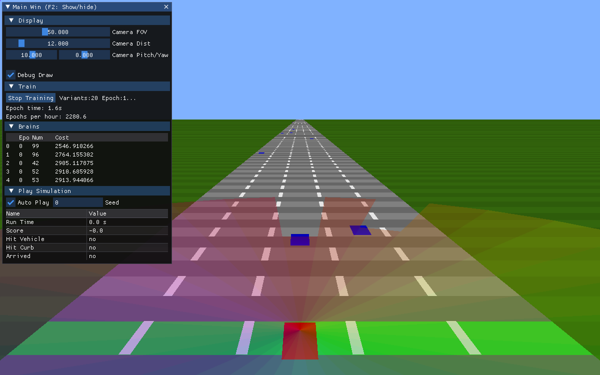

# TinyAIDriver

An example of an minimal obstacle avoidance self-driving AI written in C++.

The AI uses **Neural Networks** trained with Genetic Algorithms.

External libraries SDL2, ImGui, glm, glew and OpenGL are used for graphics and user interface.



## Features

- Neural network implementation for vehicle control
- Real-time visualization of the AI decision-making process
- Training and evolution system for the AI
- Dynamic traffic simulation
- Interactive UI for controlling simulation parameters

## Building and Running

### Prerequisites

- CMake 3.7 or higher
- C++20 compatible compiler
- Git

### Getting the Dependencies

The project uses several external libraries (SDL2, ImGui, GLM, fmt) which are fetched automatically. Run:

```bash
./get_externals.sh
```

### Building the Project

```bash
./build.sh
```

The executable will be placed in the `_bin` directory.

### Running the Simulation

```bash
./_bin/TinyFreeway
```

#### Command-Line Options

- `--help`: Display help information
- `--use_swrenderer`: Use software rendering instead of hardware acceleration
- `--autoexit_delay <frames>`: Automatically exit after a specified number of frames
- `--autoexit_savesshot <fname>`: Save a screenshot before automatic exit

## Controls

- UI sliders to control simulation parameters
- Toggle training/playing modes
- Adjust neural network parameters
- View real-time statistics

## Project Structure

- `Common/`: Core utilities for SDL2, OpenGL, and ImGui integration
- `TinyFreeway/`: Self-driving AI implementation and simulation
- `_externals/`: External dependencies (SDL2, ImGui, GLM, fmt)

## License

See the `license.txt` file for details.

## Acknowledgements

This project is a spin-off of `Demo9` from the [dpasca-sdl2-template](https://github.com/dpasca/dpasca-sdl2-template) repository.
